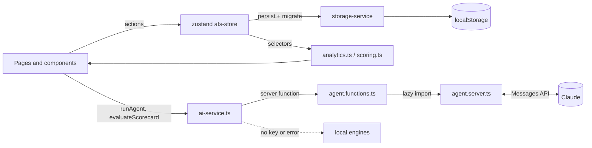

# Architecture

TalntFlow AI is a single TanStack Start app. The UI and all ATS data live in the browser. The
server renders the app shell and hosts the server functions that call Claude.

## Stack

| Layer             | Choice                                                                       |
| ----------------- | ---------------------------------------------------------------------------- |
| Framework         | TanStack Start (React 19, SSR) with file-based TanStack Router               |
| State             | zustand with `persist`, stored in `localStorage` through a swappable adapter |
| Styling           | Tailwind CSS v4 with `data-theme` token sets and a `glass` utility           |
| AI                | Anthropic SDK, `claude-opus-5-5`, server-side only                           |
| Build and hosting | Vite + Nitro, emitting the Vercel Build Output API                           |

## Directory map

```text
src/
  routes/                 one file per page: index (analytics), pipeline, agent, jobs, team,
                          integrations, scorecard, deliverables; __root is the HTML shell
  components/             app shell, Kanban board, candidate drawer, add-candidate dialog, ui/ (shadcn)
  stores/
    ats-store.ts          candidates, jobs, team, integrations, ratings, JD; actions and migration
    ui-store.ts           theme and the offline-banner flag
  lib/ats/
    types.ts              domain types and enums (stages, sources, statuses, reasons)
    seed.ts               demo data and the shared sourcing-cost table
    storage-service.ts    persistence adapter (localStorage with an in-memory fallback)
    analytics.ts          funnel, velocity, KPIs, source ROI, diversity, formatters
    scoring.ts            deterministic weighted STAR scoring and verdicts
    agent.ts              agent snapshot, tool executors, proposals, local fallback (isomorphic)
    agent.server.ts       Claude loop and scorecard summary (server only)
    agent.functions.ts    TanStack server functions that wrap agent.server.ts
    ai-service.ts         client entry point: Claude first, local fallback second
    pdf.ts                jsPDF exports
```

## Data flow



- Every change goes through a store action, so analytics recompute from the same state.
- Pages render only after the persisted stores rehydrate. Server-rendered demo data would otherwise
  flash and mismatch on hydration.
- To move to a backend, replace `storage-service.ts` with a remote adapter. The UI doesn't change.

## Persistence and migrations

The store persists under the key `qeloma-ats-v1` with a `version` number. When the persisted shape
changes, bump `version` and extend `migrateAtsState`. Version 1 links candidates to jobs, adds jobs,
team and integrations, and converts sync times to ISO timestamps. Renaming the key would silently
discard every user's data, so the key never changes.

## The agent loop

```mermaid
sequenceDiagram
  participant R as Recruiter (Agent page)
  participant S as ai-service
  participant F as runAgentTask (server)
  participant C as Claude
  participant T as Tool executors

  R->>S: task
  S->>S: toAgentSnapshot(state), without contact or EEO data
  S->>F: task + snapshot
  loop up to 8 steps
    F->>C: messages + tools
    C-->>F: tool_use blocks
    F->>T: execute against snapshot
    T-->>F: results; propose_* calls queue proposals
    F->>C: tool_result blocks
  end
  C-->>F: final summary
  F-->>S: summary, proposals, steps
  S-->>R: review list
  R->>R: Approve applies moveStage / sendEmail / addComment
```

| Tool                    | Kind     | Purpose                                                          |
| ----------------------- | -------- | ---------------------------------------------------------------- |
| `get_pipeline_overview` | read     | KPIs, funnel, bottleneck, open applications per job and stage    |
| `list_candidates`       | read     | Compact rows filtered by job, stage and days in stage            |
| `get_candidate`         | read     | Full record: history, skills, strengths, gaps, recent feedback   |
| `propose_stage_move`    | proposal | Move to another stage (standard stage emails follow on approval) |
| `propose_email`         | proposal | Reminder or feedback email                                       |
| `propose_note`          | proposal | Internal note, also used to flag concerns                        |

Guardrails:

- The agent reads a snapshot and never writes. A person approves every proposal.
- It can't reject candidates; it adds a note for a person to decide.
- Proposals are validated: the candidate must exist and be active, stages and templates must be
  known, and there's at most one proposal of each kind per candidate and 15 in total.
- Tool schemas use `strict: true`. Requests use effort `medium` and
  `fallbacks: "default"`, which retries on Anthropic's recommended model if a safety classifier
  declines.
- The SDK and key load only inside server functions; the browser bundle contains neither.

When `ANTHROPIC_API_KEY` is missing or the call fails, `runLocalAgent` runs the same tool executors
with fixed triage rules and the offline banner appears.

The scorecard summary is a single structured-output call (effort `low`, JSON schema). Claude writes
the narrative only; the weighted score and verdict come from `scoring.ts`.

## Deployment

On Vercel, Nitro detects the platform and writes `.vercel/output`: static assets plus one Node
function for SSR and server functions. `vercel.json` pins `npm ci` and `npm run build`. The only
environment variable is the optional `ANTHROPIC_API_KEY`.

## Next steps

1. Replace the storage adapter with a real database, such as Postgres behind a NestJS API or Supabase.
2. Add authentication and role-based permissions for the roles on the Team page.
3. Run the agent's tools against the database and on a schedule, for example a nightly triage that
   leaves proposals waiting for review.
